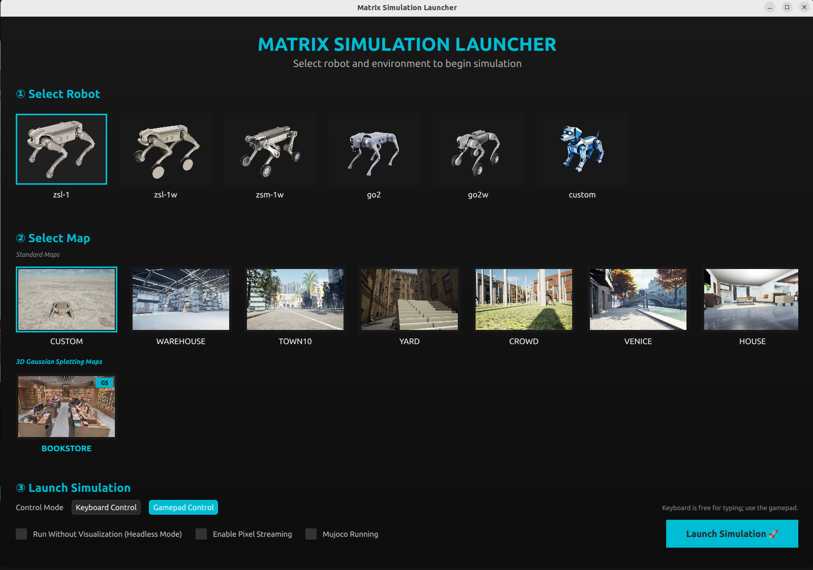

<h1>
  <a href="#"></a>
</h1>

# MATRiX
MATRiX is an advanced simulation platform that integrates **MuJoCo**, **Unreal Engine 5**, and **CARLA** to provide high-fidelity, interactive environments for quadruped robot research. Its software-in-the-loop architecture enables realistic physics, immersive visuals, and optimized sim-to-real transfer for robotics development and deployment.

  ---

  ## 📢 Latest Updates

  - **New Maps:** Added CALIBRATION、HOME、LABORATORY 3 new maps for diverse testing scenarios.
  - **Mujoco deep integration:** MUjoco 500 hz running in the background for high-frequency physics simulation， no standalone mujoco window needed，only third-party robot model window will pop up.
  - **Multi-robot support:** Added multi-robot simulation capabilities for collaborative robotics research.
  - **HighLevel API:** Added high-level API for easier robot control and environment interaction.
  - **PixelStreaming support:** Added PixelStreaming support for remote visualization and control.


  ---

  ## 📂 Directory Structure

  ```text
  ├── deps/                        # Third-party dependencies
  │   ├── ecal_5.13.3-1ppa1~jammy_amd64.deb
  │   ├── mujoco_3.3.0_x86_64_Linux.deb
  │   ├── onnx_1.51.0_x86_64_jammy_Linux.deb
  │   └── zsibot_common*.deb
  |   └── robot-forward_0.2.6_amd64.deb
  ├── scripts/                     # Build and configuration scripts
  │   ├── build_mc.sh
  │   ├── build_mujoco_sdk.sh
  │   ├── download_uesim.sh
  │   ├── install_deps.sh
  │   └── modify_config.sh
  ├── docs/                        # Documentation and guides
  ├── config/                      # Robot and sensor configuration files
  ├── scene/                       # Custom scene files
  ├── dynamicmaps/                # Dynamic ground bin files
  ├── src/
  │   ├── robot_mc/
  │   ├── robot_mujoco/
  │   ├── navigo/
  │   └── UeSim/
  ├── build.sh                     # One-click build script
  ├── run_sim.sh                   # Simulation launch script
  ├── sim_launcher                 # Launcher UI
  ├── README_CN.md                 # Chinese Project documentation
  └── README.md                    # Project documentation
  
  ```

  ---

  ## ⚙️ Environment Dependencies

  - **Operating System:** Ubuntu 22.04  
  - **Recommended GPU:** NVIDIA RTX 4060 or above  
  - **Unreal Engine:** Integrated (no separate installation required)  
  - **Build Environment:**  
    - GCC/G++ ≥ C++11  
    - CMake ≥ 3.16  
  - **MuJoCo:** 3.3.0 open-source version (integrated)  
  - **Remote Controller:** Required (Recommended: *Logitech Wireless Gamepad F710*)  
  - **Python Dependency:** `gdown`  
  - **ROS Dependency:** `ROS_humble`  

  ---

  ## 🚀 Installation & Build

  1. **Download MATRiX simulator**

     - **Method 1: Google Drive**  
       [Google Drive Download Link](https://drive.google.com/file/d/1LoTiWKsyU8PbIUZ9EhcfEbRtMhKm_OMP/view?usp=sharing)

       **Download via gdown:**
       ```bash
       pip install gdown
       gdown https://drive.google.com/uc?id=1LoTiWKsyU8PbIUZ9EhcfEbRtMhKm_OMP
       ```
       
     - **Method 2: Baidu Netdisk**  
       [Baidu Netdisk Link](https://pan.baidu.com/s/1PpzrwsJ0CkZHOZT4MaNfHQ?pwd=dku4)  


      > **Note:** When downloading from the cloud storage links, please ensure you select the latest version for the best compatibility and features.

      > **Previous version link**: [Link](https://drive.google.com/drive/folders/1JN9K3m6ZvmVpHY9BLk4k_Yj9vndyh8nT?usp=sharing)


  2. **Unzip**
     ```bash
     unzip <downloaded_filename>
     ```

  3. **Install Dependencies**
     ```bash
     cd matrix
     ./scripts/build.sh
     ```
     *(This script will automatically install all required dependencies.)*

  ---

  ## 🏞️ Demo Environments

  <div align="center">

  | **Map**         | **Demo Screenshot**                          | **Map**         | **Demo Screenshot**                          |
  |:---------------:|:-------------------------------------------:|:---------------:|:-------------------------------------------:|
  | **Venice**      |  | **Warehouse**   |  |
  | **Town10**      |        | **Yard**        |  |

  </div>

  > **Guide:** For the full robot list, map descriptions, and preview images, see [docs/Robots_Maps_Descriptions.md](docs/Robots_Maps_Descriptions.md).

  > **Note:** The above screenshots showcase high-fidelity UE5 rendering for robotics and reinforcement learning experiments.

  ---

  ## 📚 Detailed Guides

  For step-by-step setup and advanced usage, refer to the dedicated tutorials:

  - **Custom Scene Tutorial:** [docs/Custom_Map_Tutorial.md](docs/Custom_Map_Tutorial.md)
  - **Custom Robot Tutorial:** [docs/Custom_Robot_Tutorial.md](docs/Custom_Robot_Tutorial.md)
  - **Sensor Configuration Tutorial:** [docs/Sensor_Config_Tutorial.md](docs/Sensor_Config_Tutorial.md)
  - **Multi-Robot Tutorial:** [docs/Multi_Robot_Tutorial.md](docs/Multi_Robot_Tutorial.md)
  - **Docker Tutorial:** [docs/Docker_Tutorial.md](docs/Docker_Tutorial.md)
  - **Pixel Streaming Guide:** [docs/pixelstreaming_tutorial.md](docs/pixelstreaming_tutorial.md)
  - **Robots and Maps Reference:** [docs/Robots_Maps_Descriptions.md](docs/Robots_Maps_Descriptions.md)

  ---

  ## ▶️ Running the Simulation

  <div align="center">
    
  </div>

  ## 🐕 Simulation Setup Guide

  1. **Run the launcher**
  ```bash
      cd matrix
      ./open_sim_launcher
  ```
  2. **Select Robot Type**  
    Choose the type of quadruped robot for the simulation.

  3. **Select Environment**  
    Pick the desired simulation environment or map.

  4. **Choose Control Device**  
    Select your preferred control device:  
    - **Gamepad Control**  
    - **Keyboard Control**

  5. **Enable Headless Mode (Optional)**  
    Toggle the **Headless Mode** option for running the simulation without a graphical interface.

  6. **Launch Simulation**  
    Click the **Launch Simulation** button to start the simulation.

  During simulation, if the UE window is active, you can press **ALT + TAB** to switch out of it.  
  Then, use the control-mode toggle button on the launcher to switch between gamepad and keyboard control at any time.
  ## 🎮 Remote Controller Instructions (Gamepad Control Guide)

  | Action                              | Controller Input                        |
  |--------------------------------------|-----------------------------------------|
  | Stand / Sit                         | Hold **LB** + **Y**                     |
  | Move Forward / Back / Left / Right  | **Left Stick** (up / down / left / right)|
  | Rotate Left / Right                 | **Right Stick** (left / right)          |
  | Jump Forward                        | Hold **RB** + **Y**                     |
  | Jump in Place                       | Hold **RB** + **X**                     |
  | Somersault                          | Hold **RB** + **B**                     |
  
  ## ⌨️ Remote Controller Instructions (Keyboard Control Guide)

  | Action                              | Controller Input                        |
  |--------------------------------------|-----------------------------------------|
  | Stand                               | U                                       |
  | Sit                                 | Space                                   |
  | Move Forward / Back / Left / Right  | W / S / A / D                           |
  | Rotate Left / Right                 | Q / E                                   |
  | Start                               | Enter                                   |

  Press the **V** key to toggle between free camera and robot view.  

  Hold the **left mouse button** to temporarily switch to free camera mode.

  ---

  ## 🤖 Multi-Robot Simulation *(Temporarily Unavailable)*

> ⚠️ **This feature is temporarily unavailable. The content below is for reference only and not yet functional.**

MATRiX supports simultaneous simulation of multiple robots in the same environment.

- Define multiple robot instances in `config/config.json`
- Assign unique `state_port` and `cmd_port` values to each robot
- Configure sensors independently for each robot as needed

> 📘 **Detailed setup and examples:** [docs/Multi_Robot_Tutorial.md](docs/Multi_Robot_Tutorial.md)

  ---

  ## 🔧 Configuration Guide

  ### Custom scene setup
  - Define your custom scene in `scene/scene.json`
  - Select **Custom Map** in the launcher to load it
  - UE initializes the scene from the JSON file and synchronizes it with MuJoCo
  - Full format, supported elements, and examples: [docs/Custom_Map_Tutorial.md](docs/Custom_Map_Tutorial.md)

  ### Custom robot setup

  - MATRiX provides a built-in `custom` robot type for integrating your own quadruped MuJoCo model.
  - Replace the default robot definition in `src/UeSim/Linux/zsibot_mujoco_ue/Content/model/custom/custom.xml` with your own model.
  - Keep `src/UeSim/Linux/zsibot_mujoco_ue/Content/model/custom/custom.xml` and `src/robot_mujoco/robots/custom/custom.xml` synchronized.
  - Update IMU, camera, and other sensor definitions in `custom.xml` so they match your robot structure and mounting locations.
  - Select `custom` in the launcher and enable MuJoCo mode to run your own controller in the expected workflow.
  - Full integration steps and troubleshooting: [docs/Custom_Robot_Tutorial.md](docs/Custom_Robot_Tutorial.md)

  ### Adjust Sensor Configuration

  - Edit `config/config.json` to configure robot sensors used at runtime.
  - You can start from `config/config_default.json`, `config/config_wideanglecamera.json`, or `config/config_panorama.json`, then copy the result to `config/config.json`.
  - Typical configurable items include sensor **pose**, **topic**, **frequency**, **resolution**, **field of view**, and **number of sensors**.
  - For panorama sensors, configure `height`; the default panorama `width` is `2 x height`.
  - Removing unused sensors can improve **UE FPS performance**.
  - Full sensor setup guide: [docs/Sensor_Config_Tutorial.md](docs/Sensor_Config_Tutorial.md).

  ### Pixel Streaming

  - Pixel Streaming allows you to view the simulation remotely in a browser
  - Start the signalling/web server first, then enable Pixel Streaming in MATRiX
  - Default local access is through `http://127.0.0.1`
  - Full setup and troubleshooting guide: [docs/pixelstreaming_tutorial.md](docs/pixelstreaming_tutorial.md)

---

## 📡 Sensor Data Post-processing

- The depth camera outputs images as `sensor_msgs::msg::Image` with **32FC1 encoding**.
- To obtain a grayscale depth image, use the following code snippet:

```cpp
  void callback(const sensor_msgs::msg::Image::SharedPtr msg)
  {
    cv::Mat depth_image;
    depth_image = cv::Mat(HEIGHT, WIDTH, CV_32FC1, const_cast<uchar*>(msg->data.data()));
  }
```

  ### Example Subscriber Code

  For a complete example of how to subscribe to and process sensor data (RGB, Depth, LiDAR) from MATRiX, please refer to the [uesim_subscriber](https://github.com/liuxinxinbit/uesim_subscriber) repository.

  **Features:**

  - 📷 RGB Camera Data Subscription - Subscribes to compressed images and displays them in real-time.
  - 🔍 Depth Image Processing - Receives depth data and visualizes it using heatmap coloring.
  - ☁️ Point Cloud Data Processing - Subscribes to LiDAR point cloud data and converts it to PCL format.
  - 📊 Real-time Visualization - Uses OpenCV windows to display sensor data in real-time.

  **Clone and Build:**
  ```bash
  # Go to your workspace src folder
  cd ~/ros2_ws/src
  
  # Clone the repository
  git clone https://github.com/liuxinxinbit/uesim_subscriber.git
  
  # Build the package
  cd ~/ros2_ws
  colcon build --packages-select uesim_subscriber
  
  # Source the workspace
  source install/setup.bash
  
  # Run the subscriber node
  ros2 run uesim_subscriber subscriber_uesim_vc
  ```
  To visualize sensor data in RViz:

  1. **Launch the simulation** as described above.
  2. **Start RViz**:
    ```bash
    rviz2
    ```
  3. **Load the configuration**:  
    Open `rviz/matrix.rviz` in RViz for a pre-configured view.

  <div align="center">
    
  </div>
  
  > **Tip:** If you want to use the depth camera data, you need to subscribe to the `depth` topic, depth image show not properly in rviz, this is because the depth image is float32, you need to convert it to uint8.

  > **Tip:** Ensure your ROS environment is properly sourced and relevant topics are being published.


  ## 🐳 Docker

  MATRiX provides a Docker-based workflow for Linux with GPU acceleration and X11 forwarding.

  - Build the image from the repository root with: `bash docker/docker_build_image.sh`
  - Start the container with: `bash docker/docker_run_gpu.sh`
  - Join the running container environment with: `bash docker/docker_join.sh`
  - By default, the simulation inside the container can be launched via `./open_sim_launcher` from `/workspace`
  - Full prerequisites, command behavior, and troubleshooting: [docs/Docker_Tutorial.md](docs/Docker_Tutorial.md)

  ---

  ## 🙏 Acknowledgements

  This project builds upon the incredible work of the following open-source projects:

  - [MuJoCo-Unreal-Engine-Plugin](https://github.com/oneclicklabs/MuJoCo-Unreal-Engine-Plugin)  
  - [MuJoCo](https://github.com/google-deepmind/mujoco)  
  - [Unreal Engine](https://github.com/EpicGames/UnrealEngine)
  - [CARLA](https://carla.org/)

  We extend our gratitude to the developers and contributors of these projects for their invaluable efforts in advancing robotics and simulation technologies.

  ---
